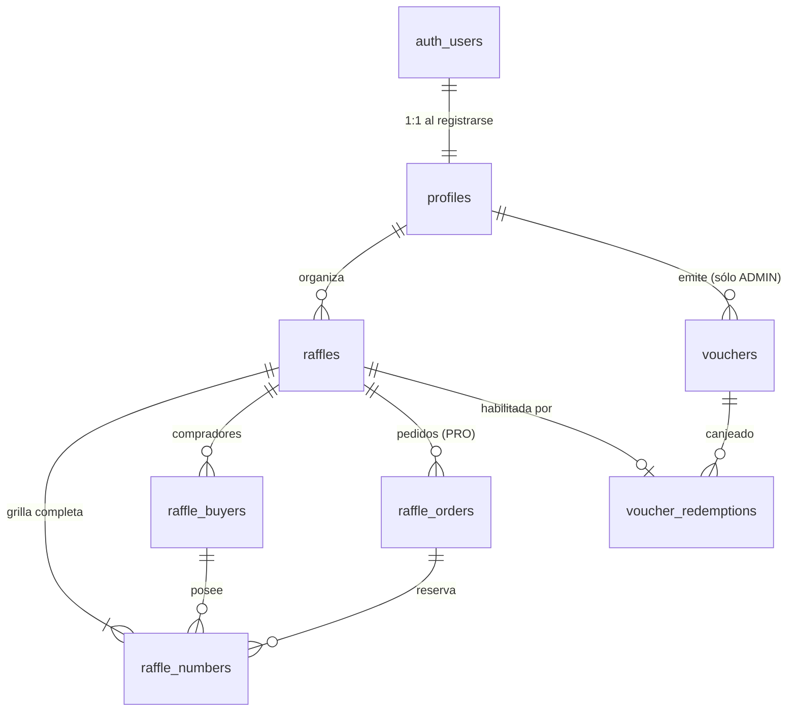

# 03 · Modelo de datos

> ## ⚠️ SUPERADO POR LA DECISIÓN DE STACK
>
> Se decidió ir a **Cloudflare Workers + D1 + Better Auth**, priorizando el
> aprendizaje del stack por encima de la eficiencia de construcción.
> El esquema es Postgres puro: enums, `numeric`, `gen_random_uuid()`, `generate_series` y triggers plpgsql **no existen en SQLite**. El diseño conceptual (tablas, relaciones, estados) sigue valiendo; la implementación no.
>
> Ver [README · decisiones](./README.md).

---

> SQL completo en [`docs/sql/`](./sql/). Este documento explica **por qué** cada
> cosa es como es. El SQL es el detalle; esto es el criterio.

## Hallazgo previo: no había esquema versionado

`supabase/migrations/` está **vacío** y no existe `supabase/config.toml`. La base
de v1 vive únicamente en el dashboard de Supabase.

Consecuencias concretas hoy:

- No hay forma de recrear la base desde cero.
- No se sabe con certeza qué policies de RLS están puestas: `getOwnerRaffle()`
  compara `raffle.owner_id !== ownerId` **en TypeScript, después de traer la
  fila**. Eso sólo tiene sentido si RLS no está filtrando — y si RLS no filtra
  `raffles`, tampoco está claro qué filtra en `raffle_buyers`, que es donde están
  los teléfonos.
- Cualquier cambio hecho a mano en producción es invisible para el repo.

**Esto es lo primero que arregla el refactor**, antes que cualquier tabla nueva:
el esquema pasa a ser código versionado.

---

## Diagrama



---

## Los tres cambios de fondo

Todo lo demás son detalles. Estos tres cambian cómo funciona el sistema.

### 1 · La grilla se materializa al crear la rifa

**v1:** sólo existe una fila en `raffle_numbers` cuando alguien compra. "Disponible"
es la *ausencia* de fila.

**v2:** se crean las N filas de entrada, todas en `AVAILABLE`.

Por qué importa:

| | Ausencia de fila (v1) | Fila materializada (v2) |
|---|---|---|
| Reservar un número | Imposible: no hay qué marcar | `UPDATE ... WHERE status='AVAILABLE'` |
| Evitar venta doble | Depende de un unique index y de atrapar el error 23505 | El predicado del UPDATE lo resuelve |
| Nota por número | No hay dónde guardarla | Columna `note` |
| Estado de la rifa | Traer todas las filas y reconstruir en memoria | Un `count(*) group by status` |
| Bloquear un número | No se puede expresar | `status = 'BLOCKED'` |

El costo es hasta 10.000 filas por rifa. Para Postgres eso no es nada — una rifa
de 1.000 números ocupa menos que una sola foto de las que hoy se suben al estado.

> Es el cambio que **habilita el plan PRO**. Sin filas materializadas no hay
> forma correcta de reservar un número.

### 2 · Las escrituras complejas viven en la base

Hoy, en `src/lib/repositories/raffle.ts`, vender números es:

```ts
// 1. insertar comprador
// 2. insertar números
// 3. si (2) falló → borrar el comprador para compensar
```

Ese paso 3 es una transacción hecha a mano desde Node. Si el proceso se cae entre
el 2 y el 3, queda un comprador huérfano para siempre. Y no hay nada que impida
que dos requests simultáneos pasen los dos chequeos.

En v2 eso es `sell_raffle_numbers()`: una función, una transacción, o pasa todo o
no pasa nada. Lo mismo para pedidos, confirmaciones, sorteo y canje de vouchers.
Ver [`docs/sql/…_rpc.sql`](./sql/20260824120600_rpc.sql).

### 3 · El visitante nunca toca una tabla

El rol `anon` no tiene permiso sobre ninguna tabla base. Ve el mundo por dos
vistas que exponen **sólo las columnas públicas**. El detalle de por qué, en
[04 · RLS](./04-rls-y-roles.md).

---

## Tablas

### `profiles`
Espejo de `auth.users`. Se crea sola al registrarse (trigger `on_auth_user_created`).

| Columna | Tipo | Nota |
|---|---|---|
| `id` | uuid PK | FK → `auth.users`, cascade |
| `display_name` | text | |
| `avatar_url` | text | |
| `contact_phone` | text | E.164, default para las rifas |
| `role` | `app_role` | `USER` \| `ADMIN` |

> **Escalada de privilegios:** la policy de UPDATE deja al usuario editar su
> propio perfil. Sin protección extra podría mandar `{ role: 'ADMIN' }` en ese
> mismo update. RLS filtra filas, no columnas, así que el bloqueo va en un
> trigger (`profiles_guard_role`) que revierte el cambio de `role` si quien lo
> hace no es admin.

### `raffles`

Cambios respecto de v1:

| Cambio | Motivo |
|---|---|
| `price` → `ticket_price` | `price` a secas es ambiguo: ¿el del número o el del premio? |
| `+ slug` | Link compartible legible |
| `+ tier` | BASIC / PRO por rifa |
| `+ number_start` | 0 → rifa 00–99 · 1 → rifa 1–100 |
| `+ prize` | Hoy se mete en la descripción |
| `+ winner_number`, `winner_buyer_id` | El anuncio del ganador es parte del ciclo |
| `+ unlock_method`, `payment_ref`, `paid_at` | Trazabilidad del cobro sin tablas de facturación |
| `+ currency` | Default ARS, previsto |
| `+ published_at`, `closed_at` | Sellados por trigger |

**Constraints que valen la pena mirar:**

```sql
-- El límite de números depende del plan, y lo controla la base.
-- Si sólo estuviera en Zod, cualquier llamada que no pase por ese formulario
-- lo saltea.
constraint raffles_total_numbers_by_tier check (
  total_numbers >= 1
  and total_numbers <= (case when tier = 'PRO' then 10000 else 1000 end)
)

-- Una rifa publicada sin teléfono es una rifa donde nadie puede comprar.
constraint raffles_published_needs_phone check (
  status <> 'PUBLISHED' or contact_phone is not null
)
```

### `raffle_buyers`

Se elimina `socials` (jsonb): existe en el esquema pero **no se usa en ninguna
parte del código**. Un jsonb sin forma definida y sin lectores es deuda.

Se agrega:

```sql
-- Un teléfono es una persona dentro de una rifa. Evita que el vecino que
-- compró tres veces figure como tres compradores distintos.
create unique index raffle_buyers_raffle_phone_key
  on public.raffle_buyers (raffle_id, phone)
  where phone is not null;
```

> Los teléfonos se guardan normalizados a E.164 (`+549341…`) por trigger, no por
> el formulario. Si la normalización vive en el front, el día que haya una
> segunda vía de carga (import, API, otro form) vas a tener el mismo teléfono
> escrito de tres formas y el índice único no va a servir de nada.

### `raffle_numbers`

PK compuesta `(raffle_id, number)` — natural y sin id sintético.

| Columna | Para qué |
|---|---|
| `status` | `AVAILABLE` \| `RESERVED` \| `SOLD` \| `BLOCKED` |
| `buyer_id` | Quién lo tiene (null si libre) |
| `order_id` | Qué pedido lo reservó |
| `reserved_until` | Vencimiento de la reserva |
| `sold_at`, `note` | Historial y anotaciones |

Dos constraints que impiden estados imposibles:

```sql
-- Un número vendido sin comprador es un número perdido: nadie sabe a quién
-- avisarle si gana.
check (status <> 'SOLD' or buyer_id is not null)

-- Una reserva sin vencimiento queda trabada para siempre y el número no
-- vuelve nunca a estar disponible.
check (status <> 'RESERVED' or reserved_until is not null)
```

### `raffle_orders` — el corazón del plan PRO

Un pedido es lo que genera el visitante al preseleccionar números.

| Columna | Para qué |
|---|---|
| `code` | Código corto (`A3F91C`) para nombrarlo en el chat de WhatsApp |
| `visitor_token` | uuid secreto: le permite al visitante **sin cuenta** volver a ver su pedido |
| `buyer_name`, `buyer_phone` | Lo que dejó. Todavía no es un comprador: puede no concretar nunca |
| `buyer_id` | Se completa al confirmar |
| `expires_at` | Cuándo se liberan los números |

> **Por qué los datos del visitante no van directo a `raffle_buyers`:** un pedido
> puede vencer o cancelarse. Si cada preselección creara un comprador, la lista
> del organizador se llenaría de gente que nunca compró nada, y el índice único
> por teléfono empezaría a chocar. Un comprador se crea recién cuando hay una
> venta confirmada.

### `vouchers` + `voucher_redemptions`

Es la razón de existir del rol ADMIN.

`voucher_redemptions.raffle_id` es **unique**: una rifa se habilita con un solo
voucher. `redeem_voucher()` toma un `FOR UPDATE` sobre el voucher, porque sin eso
dos canjes simultáneos del último uso disponible pasarían los dos.

---

## Sobre el cobro

No se modelan tablas de facturación todavía. La habilitación de una rifa se
resuelve con tres columnas en `raffles`:

```
unlock_method  FREE | VOUCHER | PAYMENT
payment_ref    id externo del pago
paid_at        cuándo
```

Cuando entre Mercado Pago, el webhook (con `service_role`) actualiza esas tres
columnas. Si más adelante hace falta historial de pagos, se agrega una tabla
`payments` que apunte a la rifa — sin migrar nada de lo existente.

Es deliberadamente lo mínimo: montar `plans` + `subscriptions` + `payments` antes
de que exista un solo cobro real es exactamente la sobreingeniería que pediste
evitar.

---

## Migración de los datos de v1

Hay datos reales en producción. El orden importa:

1. Aplicar el esquema nuevo en un proyecto Supabase **de staging**, vacío.
2. Exportar las tres tablas de v1 (`raffles`, `raffle_buyers`, `raffle_numbers`).
3. Transformar:
   - `price` → `ticket_price`
   - `number_start = 0` (v1 numeraba desde 0: `z.number().int().min(0)`)
   - generar `slug` desde `title`
   - `tier = 'BASIC'`, `unlock_method = 'FREE'` para todo lo existente
   - descartar `socials`
4. **Materializar la grilla**: por cada rifa, crear las N filas y marcar como
   `SOLD` sólo las que existían en v1. Este es el paso que no se puede improvisar.
5. Verificar los totales por rifa contra v1 (vendidos, recaudado) **antes** de
   tocar producción.

Detalle operativo en [06 · Roadmap](./06-roadmap.md), fase 4.
