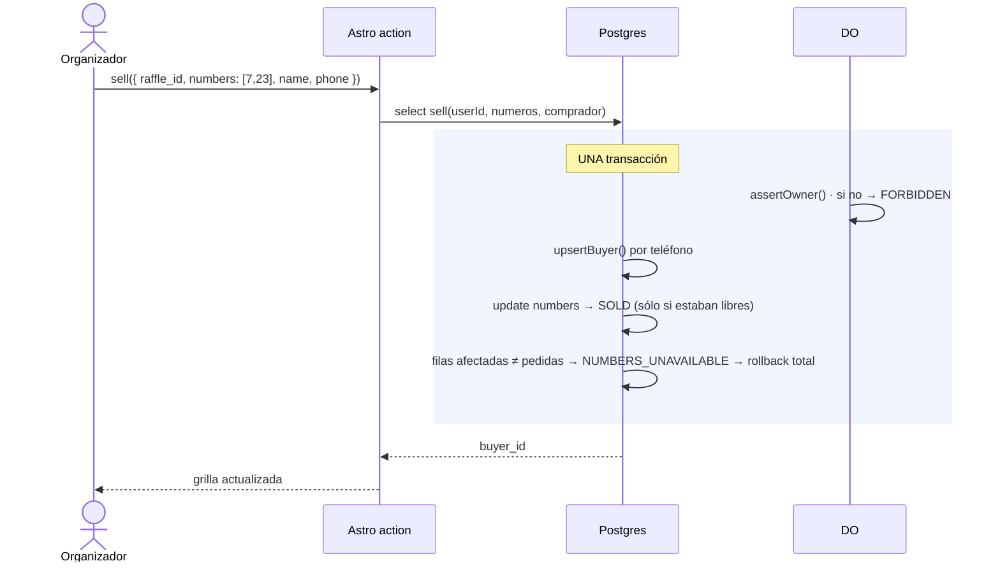
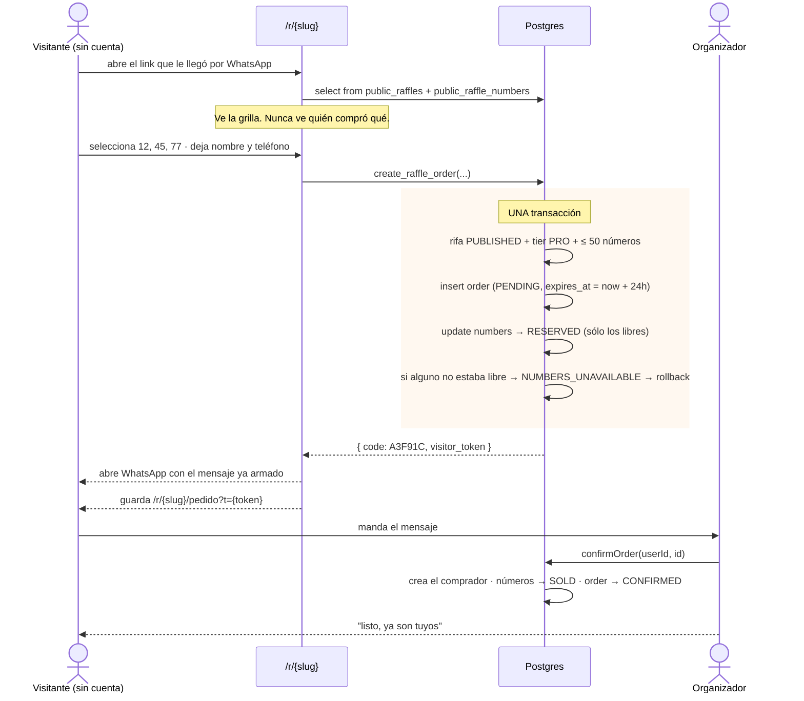
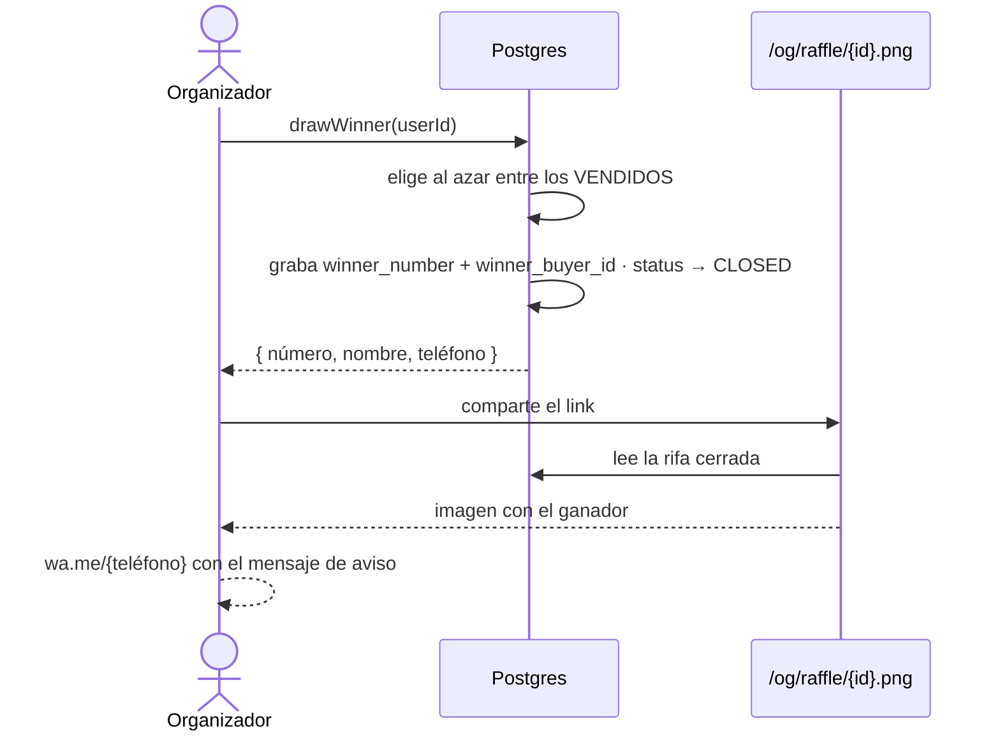
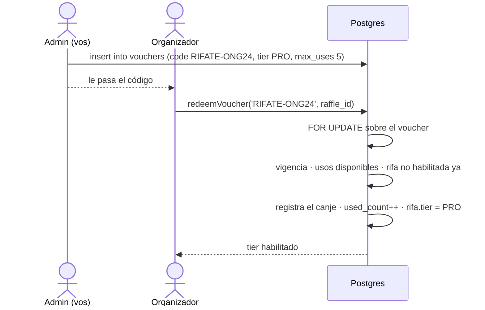

# 05 · Flujos

## 1 · Crear y publicar una rifa


Mientras está en `DRAFT` el organizador puede cambiar `total_numbers` y
`number_start`, y la grilla se reajusta sola (`resize_raffle_numbers`). Una vez
publicada, cambiar el rango rompería los números ya vendidos, y el trigger lo
rechaza.

## 2 · Venta manual — BASIC y PRO

Es el flujo que reemplaza al cuaderno. El organizador cobró por fuera (efectivo,
transferencia) y carga la venta.



**Qué cambia respecto de v1:** hoy son dos INSERT desde Node y, si el segundo
falla, se borra el comprador a mano para compensar. Si el proceso se cae en el
medio, queda un comprador huérfano. Acá o pasa todo o no pasa nada.

## 3 · Pedido del visitante — sólo PRO

Es el diferencial del plan pago.



### El punto delicado: dos personas, el mismo número

Dos visitantes piden el número 45 con milisegundos de diferencia.

```ts
// Dentro del Durable Object. Leer, decidir y escribir es seguro acá:
// el objeto atiende UN pedido por vez, así que entre ① y ③ no puede
// intercalarse nada.
reserve(numeros: number[], nombre: string, telefono: string | null) {
  const ahora = Date.now();
  const marcas = numeros.map(() => '?').join(',');

  // ① LEER
  const ocupados = this.ctx.storage.sql.exec<{ number: number }>(
    `SELECT number FROM numbers
      WHERE number IN (${marcas})
        AND NOT (status = 'AVAILABLE'
             OR (status = 'RESERVED' AND reserved_until < ?))`,
    ...numeros, ahora,
  ).toArray();

  // ② DECIDIR
  if (ocupados.length > 0) {
    return { ok: false as const, ocupados: ocupados.map((o) => o.number) };
  }

  // ③ ESCRIBIR
  /* … insertar el pedido y marcar los números como RESERVED … */
}
```

Qué pasa realmente: el segundo visitante **no ejecuta nada** hasta que el primero
termina. Su request queda encolado. Cuando le toca, el número 45 ya figura
`RESERVED` y el `SELECT` lo devuelve como ocupado.

> Esta es la razón principal por la que la grilla vive en un Durable Object y no
> en D1. En D1 el mismo código sería incorrecto: entre ① y ③ hay una ventana, y
> habría que meter la condición dentro del `UPDATE`, contar filas afectadas y
> usar la tabla `_abort` para revertir el `batch()`. Funciona, pero es un truco
> que en seis meses nadie recuerda por qué está.

### Vencimiento de reservas

Un pedido que nadie confirma tiene que soltar los números. `alarm()`
lo resuelve un **alarm del propio objeto**: no hace falta un cron global que
recorra todas las rifas.

```ts
// Al crear el pedido, se agenda la liberación.
this.ctx.storage.setAlarm(vence);

async alarm() {
  const ahora = Date.now();
  this.ctx.storage.sql.exec(
    `UPDATE numbers SET status = 'AVAILABLE', order_id = NULL, reserved_until = NULL
      WHERE status = 'RESERVED' AND reserved_until < ?`, ahora);
  this.ctx.storage.sql.exec(
    `UPDATE orders SET status = 'EXPIRED'
      WHERE status = 'PENDING' AND expires_at < ?`, ahora);
}
```

> Hay **un alarm por objeto**: `setAlarm()` reemplaza al anterior. Si hay varios
> pedidos vivos, se agenda el vencimiento más próximo y al dispararse se
> reprograma para el siguiente.

> Además, `reserve()` acepta reservas vencidas en su condición
> (`status = 'RESERVED' AND reserved_until < ahora`). Así, si el alarm no llegara
> a correr, los números igual se pueden volver a pedir. **El alarm es una
> optimización de la vista, no la garantía de corrección.**

## 4 · Sorteo y anuncio del ganador



> **Se sortea entre los números vendidos, no entre todos.** Sortear sobre la
> grilla completa puede dar un número que nadie compró, y entonces no hay ganador
> ni a quién avisarle. Se puede pasar un número a mano (`p_number`) para cuando el
> sorteo se hizo por fuera — la quiniela, por ejemplo, que es lo más común.

## 5 · Voucher



El `FOR UPDATE` no es decorativo: sin él, dos canjes simultáneos del último uso
disponible leerían `used_count` antes de que el otro escriba, y pasarían los dos.

## Errores: de Postgres a castellano

Las funciones levantan códigos estables. La capa de actions los traduce; ninguna
página debería mostrar un error de Postgres crudo.

| Código | Mensaje al usuario | HTTP |
|---|---|---|
| `NUMBERS_UNAVAILABLE` | Alguien tomó uno de esos números. Elegí otros. | 409 |
| `RAFFLE_NOT_PUBLISHED` | Esta rifa todavía no está publicada. | 400 |
| `RAFFLE_NOT_PRO` | Esta rifa no acepta pedidos online. | 400 |
| `TOO_MANY_NUMBERS` | Podés pedir hasta 50 números por vez. | 400 |
| `FORBIDDEN` | No tenés permiso para hacer esto. | 403 |
| `ORDER_NOT_PENDING` | Este pedido ya fue confirmado o cancelado. | 409 |
| `VOUCHER_EXPIRED` | Este código venció. | 400 |
| `VOUCHER_EXHAUSTED` | Este código ya se usó todas las veces. | 400 |
| `RAFFLE_HAS_SALES` | Tiene números vendidos: cancelala en lugar de borrarla. | 409 |
| `RAFFLE_NOT_RESIZABLE` | Sólo podés cambiar el rango en borrador. | 409 |

Va en `src/lib/errors.ts`, en un solo mapa. Si el mensaje se arma en
cada action, tarde o temprano dos actions dicen cosas distintas para el mismo
error.
