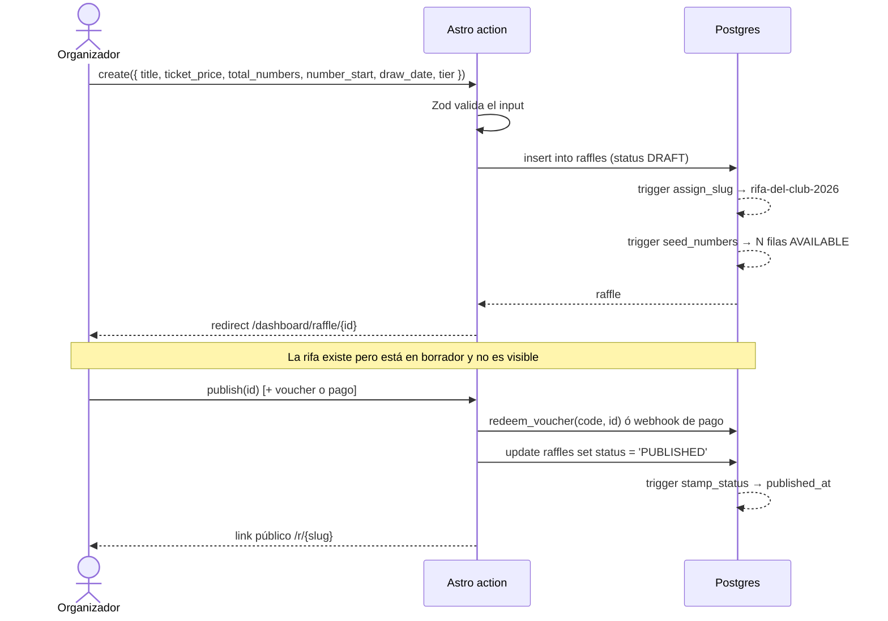
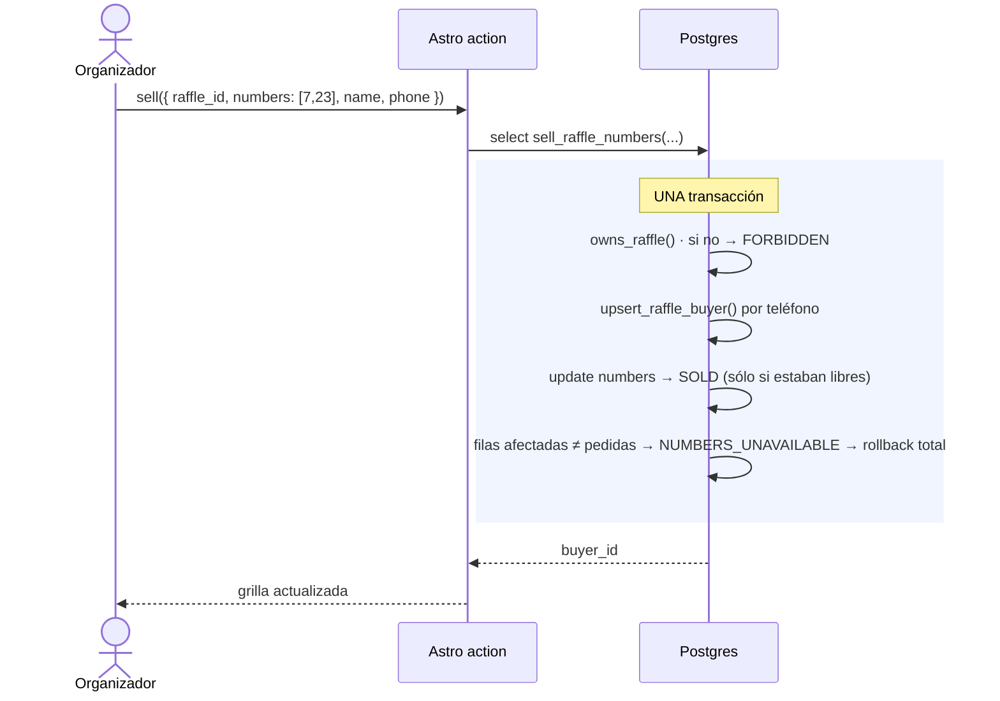
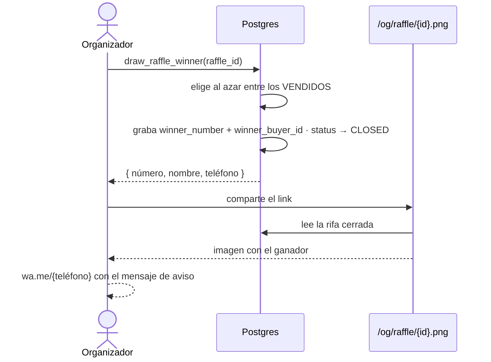
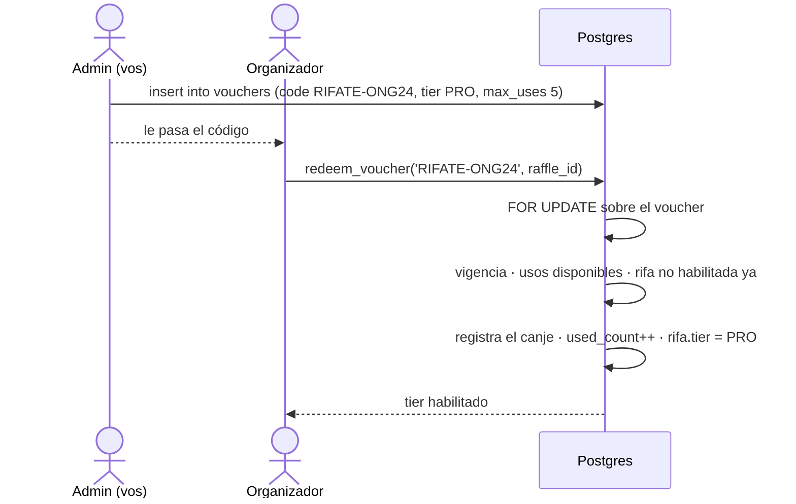

# 05 · Flujos

> ## ⚠️ SUPERADO POR LA DECISIÓN DE STACK
>
> Se decidió ir a **Cloudflare Workers + D1 + Better Auth**, priorizando el
> aprendizaje del stack por encima de la eficiencia de construcción.
> Los flujos siguen valiendo. Lo que cambia es la implementación: las funciones RPC en plpgsql pasan a ser código del Worker, y la atomicidad se resuelve con `batch()` de D1 o con un Durable Object por rifa.
>
> Ver [README · decisiones](./README.md).

---

## 1 · Crear y publicar una rifa



Mientras está en `DRAFT` el organizador puede cambiar `total_numbers` y
`number_start`, y la grilla se reajusta sola (`resize_raffle_numbers`). Una vez
publicada, cambiar el rango rompería los números ya vendidos, y el trigger lo
rechaza.

## 2 · Venta manual — BASIC y PRO

Es el flujo que reemplaza al cuaderno. El organizador cobró por fuera (efectivo,
transferencia) y carga la venta.



**Qué cambia respecto de v1:** hoy son dos INSERT desde Node y, si el segundo
falla, se borra el comprador a mano para compensar. Si el proceso se cae en el
medio, queda un comprador huérfano. Acá o pasa todo o no pasa nada.

## 3 · Pedido del visitante — sólo PRO

Es el diferencial del plan pago.


### El punto delicado: dos personas, el mismo número

Dos visitantes piden el número 45 con milisegundos de diferencia.

```sql
update public.raffle_numbers n
   set status = 'RESERVED', order_id = v_order.id, reserved_until = v_expires
 where n.raffle_id = p_raffle_id
   and n.number = any (p_numbers)
   and (n.status = 'AVAILABLE'
        or (n.status = 'RESERVED' and n.reserved_until < now()));

get diagnostics v_reserved = row_count;
if v_reserved <> v_wanted then
  raise exception 'NUMBERS_UNAVAILABLE';   -- rollback de TODO
end if;
```

Qué pasa realmente: la transacción A toma el lock de la fila 45. La B se queda
esperando ese lock. Cuando A commitea, B despierta, **vuelve a evaluar el
predicado** con el dato nuevo, ve `status = 'RESERVED'` y no actualiza nada.
`row_count` le da 0 en vez de 1, y la excepción revierte también el pedido que ya
había insertado.

No hace falta `SERIALIZABLE` ni locking explícito: alcanza con que la condición de
disponibilidad esté **dentro del `WHERE` del UPDATE** y no en un `SELECT` previo.
Chequear primero y actualizar después es justo lo que abre la ventana de carrera.

### Vencimiento de reservas

Un pedido que nadie confirma tiene que soltar los números. `expire_raffle_orders()`
lo hace, y es idempotente. Se agenda con `pg_cron`:

```sql
select cron.schedule(
  'expire-raffle-orders', '*/10 * * * *',
  $$ select public.expire_raffle_orders(); $$
);
```

> Además, `create_raffle_order` acepta reservas vencidas en su predicado
> (`status = 'RESERVED' and reserved_until < now()`). Así, si el cron se cae, los
> números igual se pueden volver a pedir. **El cron es una optimización de la
> vista, no la garantía de corrección.** No hay que depender de él.

## 4 · Sorteo y anuncio del ganador



> **Se sortea entre los números vendidos, no entre todos.** Sortear sobre la
> grilla completa puede dar un número que nadie compró, y entonces no hay ganador
> ni a quién avisarle. Se puede pasar un número a mano (`p_number`) para cuando el
> sorteo se hizo por fuera — la quiniela, por ejemplo, que es lo más común.

## 5 · Voucher



El `FOR UPDATE` no es decorativo: sin él, dos canjes simultáneos del último uso
disponible leerían `used_count` antes de que el otro escriba, y pasarían los dos.

## Errores: de Postgres a castellano

Las funciones levantan códigos estables. La capa de actions los traduce; ninguna
página debería mostrar un error de Postgres crudo.

| Código | Mensaje al usuario | HTTP |
|---|---|---|
| `NUMBERS_UNAVAILABLE` | Alguien tomó uno de esos números. Elegí otros. | 409 |
| `RAFFLE_NOT_PUBLISHED` | Esta rifa todavía no está publicada. | 400 |
| `RAFFLE_NOT_PRO` | Esta rifa no acepta pedidos online. | 400 |
| `TOO_MANY_NUMBERS` | Podés pedir hasta 50 números por vez. | 400 |
| `FORBIDDEN` | No tenés permiso para hacer esto. | 403 |
| `ORDER_NOT_PENDING` | Este pedido ya fue confirmado o cancelado. | 409 |
| `VOUCHER_EXPIRED` | Este código venció. | 400 |
| `VOUCHER_EXHAUSTED` | Este código ya se usó todas las veces. | 400 |
| `RAFFLE_HAS_SALES` | Tiene números vendidos: cancelala en lugar de borrarla. | 409 |
| `RAFFLE_NOT_RESIZABLE` | Sólo podés cambiar el rango en borrador. | 409 |

Va en `src/lib/supabase/errors.ts`, en un solo mapa. Si el mensaje se arma en
cada action, tarde o temprano dos actions dicen cosas distintas para el mismo
error.
